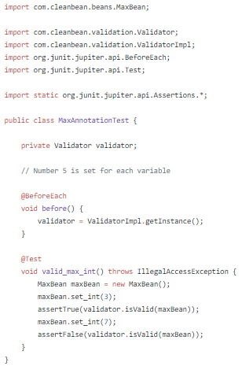

# CleanBean 

CleanBean is a bean validation library. It is developed based on Bean Validation (JSR-303) and Lombok projects.

In the future, I will continue to add different annotations for field validation and also develop annotations similar to those used in the Lombok project for R&D purposes.

It has 5 annotation for now and those are : 

* @Min
* @Max
* @Size
* @Mail
* @Regex

The library is easy to implement for the field validations. 

### Example

For example, if we want to validate the variable named int of the MaxBean POJO above, it is sufficient to call the Validator instance and use the isValid() function, as we did in the MaxAnnotationTest class below. 

